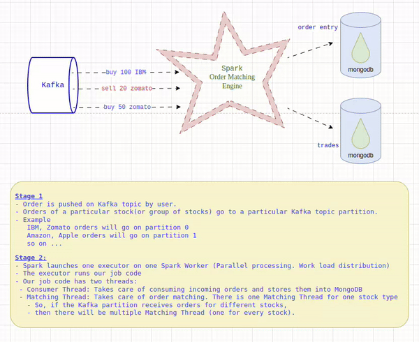

### Introduction
* How to write an order matching system, which is distributed, resilient, parallel processed and horizontally scalable ?
* In this example, we have utilised Apache Spark for distributed, resilient parallel processing for incoming orders.
* We have also used Apache Kafka, to handle incoming orders, serialise them into Apache Spark for parallel processing.
* This is a version 1, and is complete to demonstrate the integration of Kafka, Spark(PySpark with external dependencies) & MongoDB.

### Image representation


### Processing Stages
* Stage 1 :
  * Order is pushed on kafka topic by user.
  * Orders of a particular stock (or a bunch of stock) goes on a particular partition (kafka topic partition)
  * Example 
    * IBM, Zoomato orders will go on partition 0
    * Amazon, Apple orders will go on partition 1
    * so on ...
* Stage 2 :
  * Spark smartly launches one executor on one Spark Worker (Parallel processing. Work load distribution)
  * The executor runs our job code.
  * Our job code has two threads:
    * Consumer Thread -- Takes care of consuming the incoming orders on Kafka topic and stores them into MongoDB
    * Matching Thread -- Takes care of order matching. There is one Matching Thread for one stock type. So, if the kafka partition receives orders for different stocks, then there will be multiple Matching Thread (one for every stock).

### How does Parallelism work in Apache Spark Streaming application ?
* It's simple
* Ideally, as many Kafka partitions, that many Spark Workers (Servers) and that many parallelism. 
* If we have more Kafka partition, Spark smartly distributes responsibility among the Spark Workers, such that every partition gets read.
* If we have more Spark Worker, than there is no advantage, Since one Kafka partition can be read by one job(from one consumer group) at a time.
* Incoming messages gets distributed on Kafka partition and gets parallel processed by Spark Workers.

### How to scale without changing code ?
* Horizontal Scaling
  * Simply add additional Spark Worker, and partition the Kafka topics accordingly (as many kafka topic partition, that many Spark Worker)
  * There is no limit to Horizontal Scaling.
* Vertical Scaling
  * Simply add more memories, more CPUs to the Spark Worker (Server/VM)
  * Vertical Scaling gets limited by VM/Server infra/strength.
* No code change is needed.

### Build Spark image (needed only once)
```
]$ cd order_matching_system/docker_compose/build_spark_image
total 12
-rw-rw-r-- 1 manoj manoj 1598 Sep 13 10:36 Dockerfile
-rw-rw-r-- 1 manoj manoj  856 Sep 13 10:38 start-spark.sh
]$ docker build -t oms-spark:3.5.2 .
```

### Create cache folders
```
cd order_matching_system/docker_compose
mkdir kafka{1,2,3}_cache zoo1_cache
sudo chown -R 1001:1001 kafka{1,2,3}_cache zoo1_cache
```

### Copy/Upload code to drive
```
]$ cd order_matching_system/python
]$ cp trade.py order_matching_system.py mango.py python_package_dependency/job_dependencies.tar.gz ../docker_compose/oms_python/
]$ cd ../docker_compose/oms_python/
]$ tar xvf python_package_dependency/job_dependencies.tar.gz
```

### Start Environment
```
 docker compose -f docker-compose.yml up
```

### Create Kafka topic
* Since we have two kafka workers, we are creating two Kafka partitions for Kafka topic name=stockorder
```
docker exec -it kafka2 bash
kafka-topics.sh --bootstrap-server 0:9092 --list

kafka-topics.sh --bootstrap-server 0:9092 --create --topic stockorder --partitions 2 --replication-factor 1
    Created topic stockorder.
    
kafka-topics.sh --bootstrap-server  0:9092 --list
    stockorder
``` 

### Enable Replication between mongodb instances and initialise objects
```
docker exec -it mongo1 bash
root@mongo1:/# mongosh --host mongo1:27017 -f docker-entrypoint-initdb.d/mongo-repl.js

After 30seconds 
root@mongo1:/# mongosh --host mongo1:27017 -f docker-entrypoint-initdb.d/mongo-init.js
```

### After a min, Check if mongodb objects are created
```
root@mongo1:/# mongosh --host mongo1:27017 
oms-mongo-rset [direct: primary] test> use order_matching_system
switched to db order_matching_system
oms-mongo-rset [direct: primary] order_matching_system> show collections
account
stock
stock.order.amazon
stock.order.apple
stock.order.ibm
stock.order.zoomato
stock.trade.amazon
stock.trade.apple
stock.trade.ibm
stock.trade.zoomato
oms-mongo-rset [direct: primary] order_matching_system> 
```

### Can also verify mongodb web at below location
```
  * http://localhost:8084/
  * Ensure DB -- order_matching_system
  * Ensure Collection -- account, stock, stock.orders.*, stock.trade.*
```


### Submitting/Pushing PySpark code
```
docker exec -it smaster bash
export SPARK_PACKAGES=org.apache.spark:spark-streaming-kafka-0-10_2.12:3.5.2,org.apache.spark:spark-sql-kafka-0-10_2.12:3.5.2

cd /opt/spark/bin
mkdir oms_python
cd oms_python
tar xvf /tmp/job_dependencies.tar.gz
export PYSPARK_PYTHON=./oms_python/bin/python
cd ..
root@smaster:/opt/spark/bin# ./spark-submit --packages $SPARK_PACKAGES --archives /tmp/job_dependencies.tar.gz#oms_python --py-files /tmp/models.py,/tmp/config.py,/tmp/mango.py /tmp/order_matching_system.py
```

]$ docker exec -it smaster bash
export SPARK_PACKAGES=org.apache.spark:spark-streaming-kafka-0-10_2.12:3.5.2,org.apache.spark:spark-sql-kafka-0-10_2.12:3.5.2
root@smaster> cd /opt/spark/bin/
root@smaster> export PYSPARK_PYTHON=./oms_python/bin/python
root@smaster> export PYSPARK_FILES=/opt/spark/bin/oms_python/trade.py,/opt/spark/bin/oms_python/mango.py
root@smaster> export PYSPARK_ARCHIVES='/opt/spark/bin/oms_python/job_dependencies.tar.gz#oms_python'
root@smaster> ./spark-submit --packages $SPARK_PACKAGES --archives $PYSPARK_ARCHIVES --py-files $PYSPARK_FILES /opt/spark/bin/oms_python/order_matching_system.py


### Run push_order.py to push random orders into Kafka.
```
python push_order.py
```
* Verify that the order land in stock.order collection and as well gets matched.
* Matched orders will appear in stock.trade collection.

### Version 1 to Version 2
* Version 2 carries the code for automated order matching.
* The order matching thread runs in the Spark Job.
* Version 1 had one Standalone instance of MongoDB
* Version 2 needed MongoDB transactions, which in turn needed(demanded) an additional Replica instance of MongoDB.
* Hence, version 2 has multiple/replicated/clustered instances(two) of MongoDB.

### This is end of Version 2

### Version 3 (in Plan)
* To have some visualisation tool
* To have reconciliation tool for trades
* And also to see top 5 order book (left/buy, right/sell)