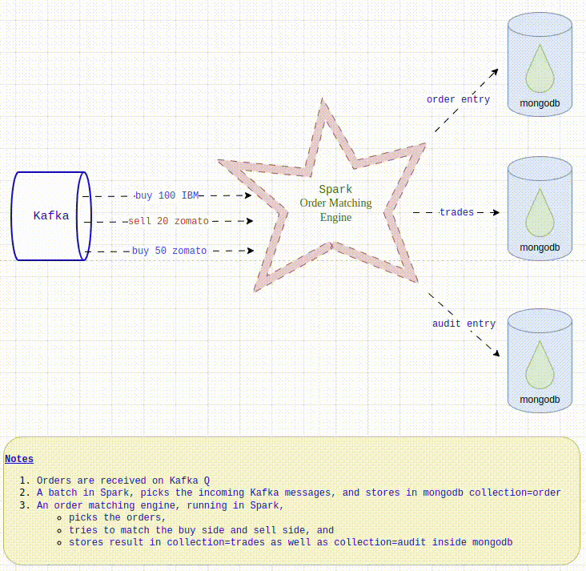

### Introduction
* How to write an order matching system, which is distributed, resilient, parallel processed and horizontally scalable ?
* In this example, we have utilised Apache Spark for distributed, resilient parallel processing for incoming orders.
* We have also used Apache Kafka, to handle incoming orders, serialise them into Apache Spark for parallel processing.
* This is a version 1, and is complete to demonstrate the integration of Kafka, Spark(PySpark with external dependencies) & MongoDB.

### Image representation


### Build Spark image (needed only once)
```
]$ cd order_matching_system/docker_compose/build_spark_image
total 12
-rw-rw-r-- 1 manoj manoj 1598 Sep 13 10:36 Dockerfile
-rw-rw-r-- 1 manoj manoj  856 Sep 13 10:38 start-spark.sh
]$ sudo docker build -t oms-spark:3.5.2 .
```

### Create cache folders
```
cd order_matching_system/docker_compose
mkdir kafka{1,2,3}_cache zoo1_cache
sudo chown -R 1001:1001 kafka{1,2,3}_cache zoo1_cache
```

### Start Environment
```
 sudo docker compose -f docker-compose.yml up
```

### Create Kafka topic
```
sudo docker exec -it kafka2 bash
kafka-topics.sh --bootstrap-server 0:9092 --list 
kafka-topics.sh --bootstrap-server 0:9092 --create --topic apple --partitions 1 --replication-factor 1
    Created topic apple.
kafka-topics.sh --bootstrap-server  0:9092 --list
    apple
```

### Check if mongodb objects are created
```
  * http://localhost:8084/
  * Ensure DB -- order_matching_system
  * Ensure Collection -- account, stock, stock.audit.*, stock.orders.*, stock.trade.*
```

### Upload code
```
]$ cd python
]$ ls
config.py  mango.py  models.py  order_matching_system.py  python_package_dependency

sudo docker cp config.py smaster:/tmp/ 
sudo docker cp mango.py smaster:/tmp/
sudo docker cp models.py smaster:/tmp/
sudo docker cp order_matching_system.py smaster:/tmp/
sudo docker cp python_package_dependency/job_dependencies.tar.gz smaster:/tmp/
```

### Submitting/Pushing PySpark code
```
sudo docker exec -it smaster bash
export SPARK_PACKAGES=org.apache.spark:spark-streaming-kafka-0-10_2.12:3.5.2,org.apache.spark:spark-sql-kafka-0-10_2.12:3.5.2

cd /opt/spark/bin
mkdir oms_python
cd oms_python
tar xvf /tmp/job_dependencies.tar.gz
export PYSPARK_PYTHON=./oms_python/bin/python
cd ..
root@smaster:/opt/spark/bin# ./spark-submit --packages $SPARK_PACKAGES --archives /tmp/job_dependencies.tar.gz#oms_python --py-files /tmp/models.py,/tmp/config.py,/tmp/mango.py /tmp/order_matching_system.py
```

### Run push_order.py to push random orders into Kafka.
```
python push_order.py
```

### This is end of Version 1

### Version 2 (Dev work ongoing)
* Run order matching engine (Below Algo)
```
Call order_matching_engine:
    order_matching_engine :
        for Buy Order (Right_List)
            Sort Orders based on (1) limit_price dsc, (2) order_id (which has timestamp) asc
                buy_orders[limit_price] = [order_id, order_id ...] timestamp sorted
        for Sell Order (Left_List)
            Sort Orders based on (1) limit_price asc, (2) order_id (which has timestamp) asc
                sel_orders[limit_price] = [order_id, order_id ...] timestamp sorted

        sorted_buy_orders = sorted.keys of buy_orders (dsc)
        sorted_sel_orders = sorted.keys of sel_orders (asc)
        top_buy_price = shift sorted_buy_orders
        top_sel_price = shift sorted_sel_orders
        top_buy_order = shift buy_orders[top_buy_price]
        top_sel_order = shift sel_orders[top_sel_price]

        while top_buy_price >= top_sel_price: its a trade

            if top_buy_order.quantity >= top_sel_order.quantity:
                 fill_quantity(buy_order_id=top_buy_order.order_id, sel_order_id=top_sel_order.order_id, trade_quantity=top_sel_order.quantity, trade_price=top_sel_price)
                 top_sel_order = shift sel_orders[top_sel_price]
                 if top_buy_order.quantity == top_sel_order.quantity:
                    top_buy_order = shift buy_orders[top_buy_price]
                    buy_order_status = 'Filled'
                    sel_order_status = 'Filled'
                 else:
                    buy_order_status = 'Partial Filled'
                    sel_order_status = 'Filled'
            else:
                 sel_order_status = 'Partial Filled'
                 buy_order_status = 'Filled'
                 fill_quantity(buy_order_id=top_buy_order.order_id, sel_order_id=top_sel_order.order_id, trade_quantity=top_buy_order.quantity, trade_price=top_sel_price)
                 top_buy_order = shift buy_orders[top_buy_price]

            if top_buy_order is null:
                top_buy_price = shift sorted_buy_orders
                top_buy_order = shift buy_orders[top_buy_price]

            if top_sel_order is null:
                top_sel_price = shift sorted_sel_orders
                top_sel_order = shift sel_orders[top_sel_price]


    fill_quantity(buy_order_id, sel_order_id, trade_quantity, trade_price, buy_order_status, sel_order_status):
        trade_id = unique.id
        db.stock.trade[stock_id].insertOne({
            'trade_id': trade_id,
            'buy_order_id': buy_order_id,
            'sel_order_id': sel_order_id,
            'trade_quantity': trade_quantity,
            'trade_price': trade_price,
            'timestamp': new Date(),
        })
        db.stock.order['apple'].updateOne(
            {'order_id': buy_order_id,
             'order_quantity': {$gt : 'trade_quantity'},
             'order_price'   : {$gte: 'trade_price'   },
            },
            {
                $inc: { 'trade_quantity': trade_quantity},
                $set: { 'status' : buy_order_status}
            })
        db.stock.order['apple'].updateOne(
            {'order_id': sel_order_id,
             'order_quantity': {$gt : 'trade_quantity'},
             'order_price'   : {$gte: 'trade_price'   }, // sell order price should be
            },
            {
                $inc: { 'trade_quantity': trade_quantity},
                $set: { 'status' : sel_order_status}
            })

``` 

### Version 3
* Have some visualisation tool
* To review trades, audits
* And also to see top 5 order book (left/buy, right/sell)
